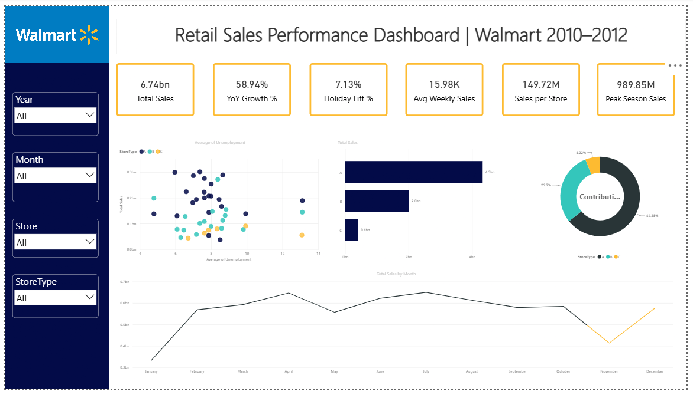

# Walmart Retail Sales Performance Analysis

## Overview
Analysis of 3 years of weekly sales data (2010–2012) across 45 Walmart
stores to identify performance gaps between store types, quantify
holiday-season impact, and assess whether external economic factors
(unemployment, fuel price) influence sales.

## Tools
- **Excel** — initial data cleaning and consolidation
- **SQL Server (T-SQL)** — dimensional modeling, data validation, analysis queries
- **Power BI** — interactive dashboard

## Key Findings
- **Store Type A dominates performance**: $4.33B total sales (22 stores)
  vs $2.00B for Type B (17 stores) and $0.41B for Type C (6 stores)
- **Holiday weeks lift sales by +7.1%** on average ($17,036/week vs $15,901)
- **Economic factors show weak correlation** with weekly sales
  (Unemployment r ≈ -0.11, Fuel Price r ≈ +0.01) — local economic
  swings are not a meaningful sales risk factor for this chain
- **7 stores flagged as statistical underperformers** (sales more than
  1 standard deviation below the chain average): Stores 33, 44, 5, 36, 38, 3, 30

## Recommendations
1. Prioritize inventory and staffing for Type A stores during
   holiday weeks (Nov–Dec, Super Bowl week)
2. Launch a root-cause review for the 7 underperforming stores —
   since economic factors don't explain the gap, investigate
   store-level drivers (competition, assortment, staffing)
3. Deprioritize economic-indicator-based forecasting adjustments
   given the weak correlation; focus planning on store-type and
   seasonality instead

## Project Structure

├── sql/ → Data prep, validation & analysis scripts
├── data/ → Source dataset (Kaggle Walmart Sales)
├── dashboard/ → Power BI file (.pbix) + exported PDF
└── report/ → One-page insight summary (Word doc)

## Data Source
[Kaggle: Walmart Dataset](https://www.kaggle.com/datasets/yasserh/walmart-dataset)

